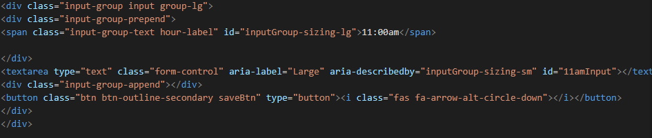

# HomeworkFive

I used this same format for each row on the planner because I wanted all of them to look the same other than the acutal label of what time it is.

Using the click function in conjuction with local storage, I made it so when you push the save button whatever you put in the text area will save even when you refresh the page.  I repeated the same step with each variable to allow local storage in each input div.

These variables are set up to display what the current date is in the "todaysDate" div.  This is possible with the moments.js api which can keep track of what day it is along with other time related features.

